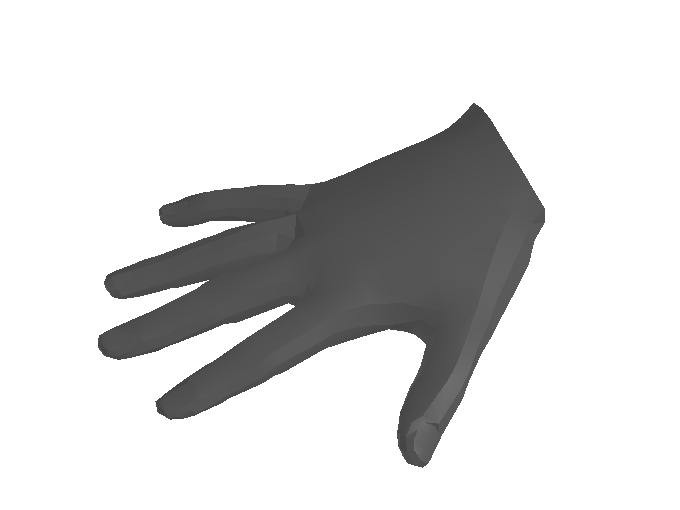

# Mano Convert

Convert [mano hands](https://mano.is.tue.mpg.de/) to chumpy-free format for easier visualization and export.



# Convert

Download and extract mano models under `mano_convert/models`. In a python 3.6 environment, run:

```bash
pip install -r requirements.txt

python convert_mano.py --type [left/right]
```

This saves a converted chumpy-free .npy file under the directory.

# Visualize

```bash
python visualize.py
```

You will want a more recent python version (>3.8) to avoid syntax issue.


